### 从最简单开始
先从一个简单的函数开始
```c++
int main (int argc, const char **argv) {
    int a = atoi(argv[1]);
    if (a > 5) {
        a = a+1;
        printf("a %d", a);
    }
    else {
        a *= 2;
        printf("a %d", a);
    }
	return 0;
}
```

直接正常编译，ida cfg如下
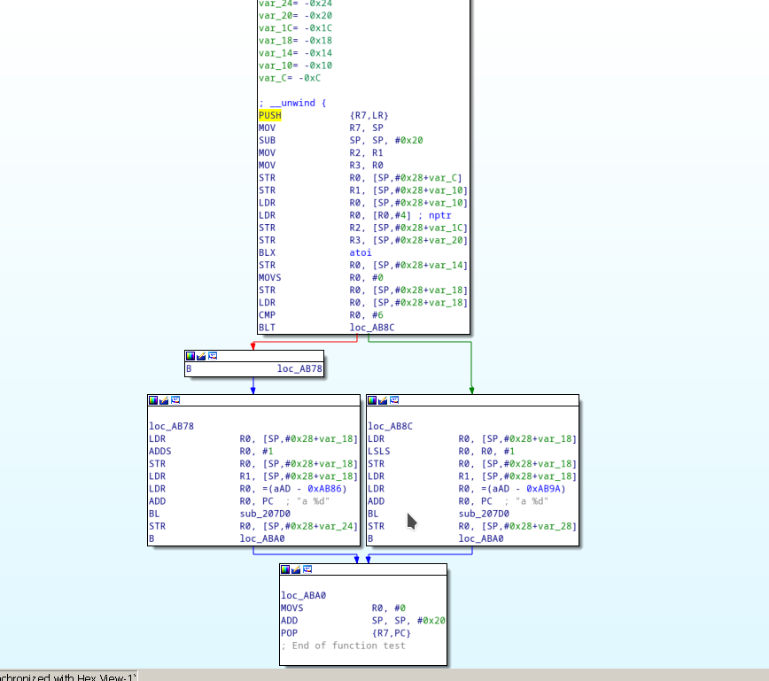
如果用ollvm加上fla（这里为了简单说说明问题，只加fla，加了其他混淆并不改变反混淆的原理）
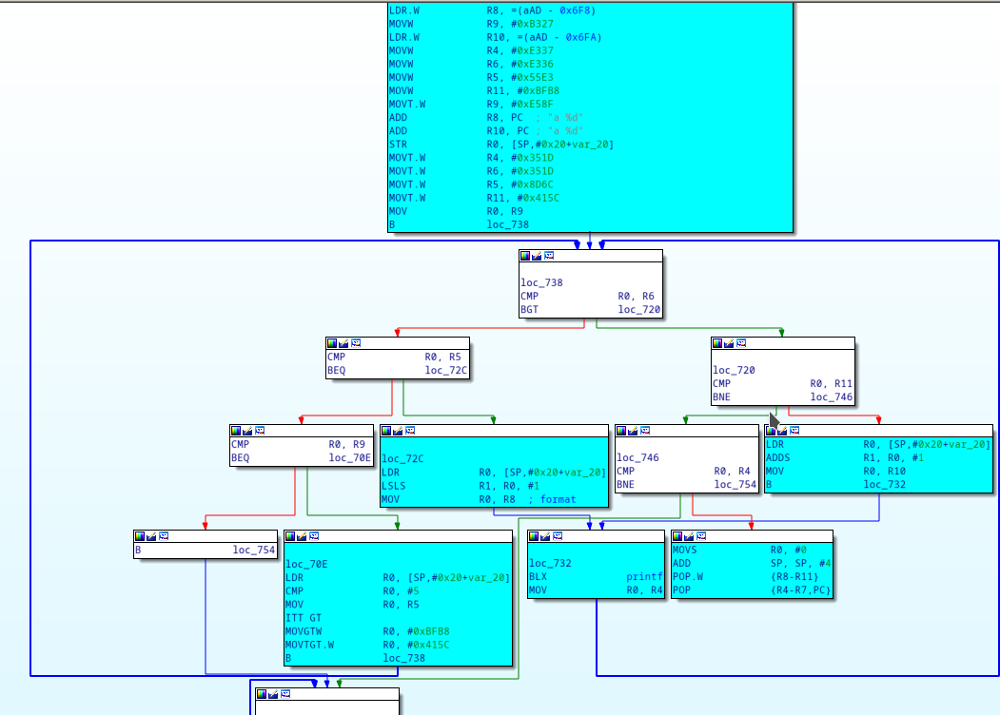
可以看到，加入了很多小块，而原来真正跟原程序相关的块，这里已经用浅蓝色标出，先来看看这样子直接F5的结果。
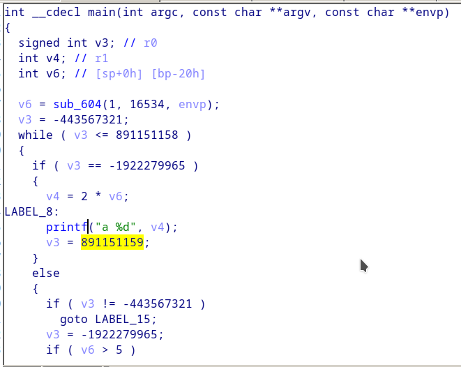
可以看到原来非常直接的顺序执行逻辑，现在变成非常不直观的平坦化逻辑，每一个真实逻辑执行完，无法直观地知道下一个真正要执行的地方是哪里。**造成这种效果的罪魁祸首就是加上去的小块**

观察一下一个真实块的逻辑

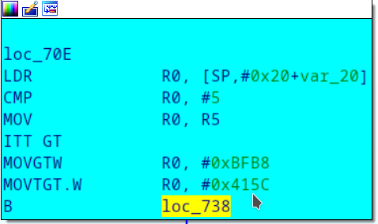

这个块对应的是原程序a变量与5比较的逻辑，只不过做完a跟5的比较判断之后，将一个很大的数字mov到R0寄存器，继续看看这个块的目的地loc_738所做的事情。

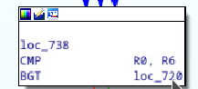

这个块做的事情只有一个，根据之前的真实块（loc_70E）mov到R0的结果，决定需要跳转到哪个块。中间可能经过其他白色块的中转，但是最终的结果肯定是另外一个真实块。这类混淆的基本逻辑是[真实块]->[控制块(0到n个)]->[下一个真实块]->[控制块(0到n个)]......
再去认真观察蓝色的真实块的特征，可以发现，所有真实块的输入，都与那些ollvm加入的分发控制块无关，比如，loc_70E的输入是var_20这个变量，与所有白色控制块所读写的寄存器无关。

基于上述观察可得，fla加入的所有白色控制块，与原程序的真实逻辑并没有任何关系，在混淆中只充当一个决定下一个真实块的分发控制作用，**如果我们知道真实块的前后关系，可以把他们直接连接起来，跳过所有白色的控制块，我们的程序依然是正确的,程序的逻辑也变得直观多了**。

于是我们反混淆需要解决以下几个问题
 - 确定哪些是fla加入的分发控制块（下文简称为控制块），其他的就是程序的真实逻辑块（下文简称真实块），这里可能会有一个疑问，如果混淆还加了bcf之类的虚假块到里面，那怎么办？这里先留着这个问题，下文会解答。
 - 确定真实块的前后顺序与关系。
 - 将真实块用跳转（B，BNE等跳转指令）连接起来

## 确定控制块
观察白色的块，其实特征非常明显，非常短(只有几条指令)，仅仅只有寄存器操作，没有内存操作,最后是cmp+跳转等等，这个不同厂商的混淆有细微的差别，但多数都特征非常明显，可以直接静态分析出来，在反混淆程序设计上，为了隔离这种差别引起的复杂性，可以用多态隔离掉就可以了。确定所有控制块后，直接用0清除这些块里面所有指令，免得干扰ida分析，因为修复成功后，所有真实块都不会经过这些控制块了。

## 确定真实块的前后关系
但从静态分析去确定真实块的关系非常浪费时间，这里可以采取两种方法
 - IDA动态调试，使用trace断点记录目标函数执行路径
 - 模拟执行目标函数，并记录执行路径

### IDA调试记录指令方式
 - 这种方法优点是借用成熟的调试工具，无需模拟环境，上手简单，缺点是如果程序有反调试，需要先将反调试干掉。这里需要借助一下idapython脚本。链接**https://github.com/maiyao1988/IDAScripts/blob/master/trace.py**
 - 脚本的原理非常简单，在待trace函数每一条指令都下一个断点，并将断点属性改为BPT_TRACE,这样断点不会停下来，但会触发原先设置好的回调函数，在回调函数中，可以指令的地址等所有信息记录下来。最后得出含有这种内容一个trace文件。
 ```
(      libxxxso[0xCBD6A000])[82 AD       ]0x0001CA34:	ADD	R5, SP, #0X208	;(SP=0x100FF248 )
(      libxxxx.so[0xCBD6A000])[E7 20       ]0x0001CA36:	MOVS	R0, #0XE7
(      libxxxx.so[0xCBD6A000])[F6 21       ]0x0001CA38:	MOVS	R1, #0XF6
(      libxxxx.so[0xCBD6A000])[F0 22       ]0x0001CA3A:	MOVS	R2, #0XF0
(      libxxxx.so[0xCBD6A000])[E0 70       ]0x0001CA3C:	STRB	R0, [R4, #3]	;(R0=0x000000E7 R4=0x100FF550 )
(      libxxxx.so[0xCBD6A000])[21 71       ]0x0001CA3E:	STRB	R1, [R4, #4]	;(R1=0x000000F6 R4=0x100FF550 )
```
   
### 模拟执行记录指令方式
利用模拟执行直接执行目标函数，也可以达到每条指令都记录下来的效果，优点是无视反调试(但也有可能遇到对抗)，缺点是需要准备好模拟环境，实现一些系统调用以及java函数等等，操作比较麻烦，对于android环境的模拟，开源界已经存在一些优秀项目如[AndroidNativeEmu](https://github.com/AeonLucid/AndroidNativeEmu),但由于该项目存在一些bug和一些未实现的系统调用，我拿来做了些改进[参见这里](https://github.com/maiyao1988/ExAndroidNativeEmu)

无论用那种方式,我们都可以得出一个记录所有执行指令的trace文件，有了这个文件我们就可以从知道真实块的前后顺序了，方法如下
 - 取出一个真实块A中的指令，定位到在trace文件中的位置n。
 - 从n+1开始跟踪，如果经过控制块，则直接跳过，直到跟踪到第一个真实块B的首条指令地址，
 - B就是A的下一个需要执行的真实块

上述方法只最简化的情况，实际上还有其他情况，比如一个真实块可能跳转到两个真实块（原程序条件跳转if）的情况，这些情况都可以通过分析trace文件来知道条件满足的时候跳到哪个真实块，不满足的时候跳到哪个真实块，这里不再一一描述。


根据动态运行的追踪来确定真实块的关系这种方法有一个缺陷，就是如果某些分支没有被执行，那么会被直接丢弃，所以这里并非100%还原，而只是还原了被执行的逻辑的关系。虽然并不完美，但总比分析那堆混淆得乱七八糟的程序要来得好多了，这里同时也解答了刚才提出的问题，如果存在bcf之类的加上去的虚假块怎么办，因为不会被执行，自然就被忽略了。

## 将真实块连接起来
知道了真实块之间的关系，就可以在块的最后patch上一些跳转指令将真实块连接起来，实际上，还有一些问题，比如哪些指令可以被patch，哪些不可以，比如，如果真实块最后是一条函数调用指令BL，这种具有逻辑意义的指令不能随便patch，还需要做一些分析。如果对这些细节感兴趣，后续会写一篇文章详细讲怎么patch。

## 写在最后
需要特别指出的是，这个方法不仅仅适用与ollvm，而是适用于类似逻辑的混淆（实测大多数，区别仅是识别控制块的逻辑有点改变而已），最后放上几张效果图
 * 某视频app
 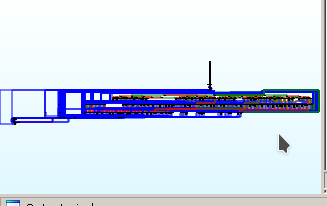
 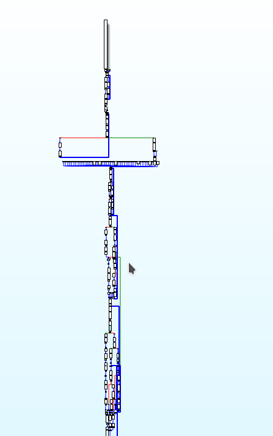
 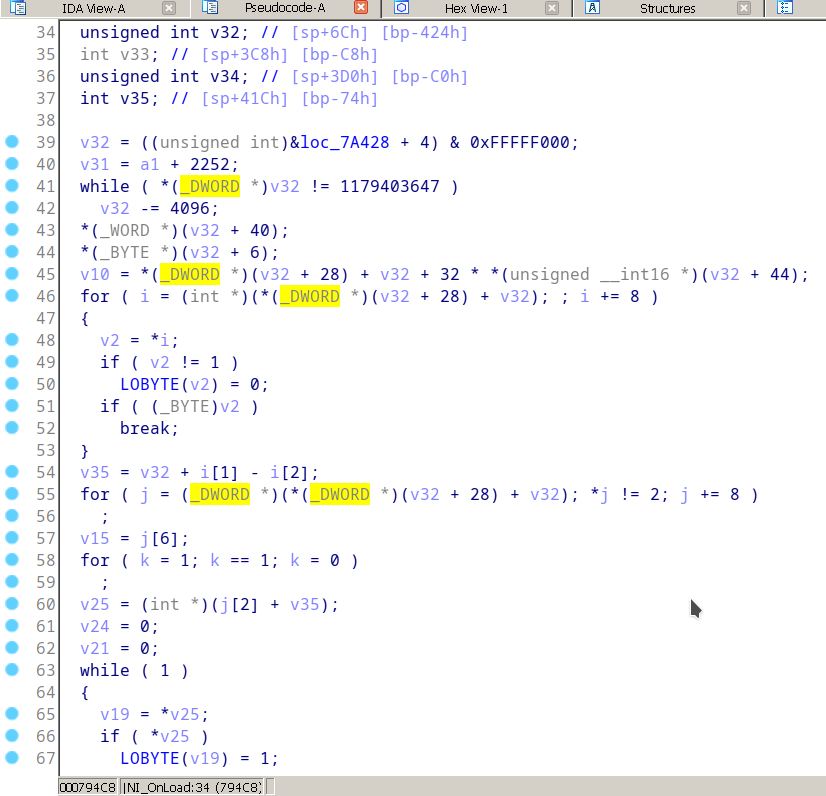
 
 * 某加固厂商的so
 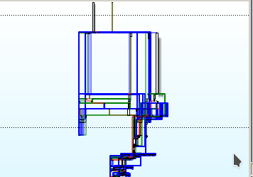
 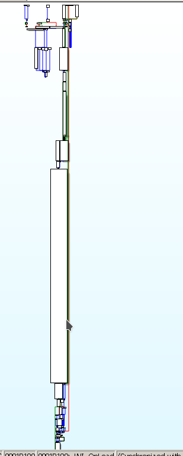
 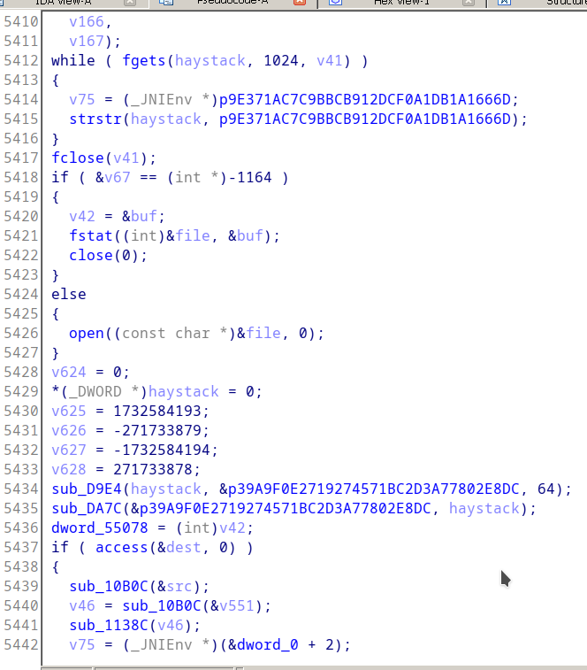


